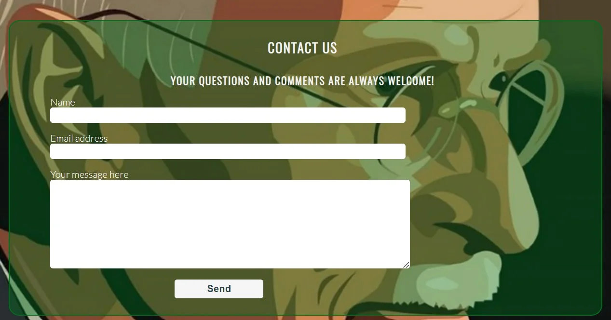

# Jungway
The rationale for Jungway is to introduce users to the Jungian way of understanding ourselves and the world. Empowering the individual is an important part of building a resilient society, and one way of achieving that is by helping individuals to embrace their shadows and to go through the process of what Jung calls individuation. Jungway is a gateway towards that process. It provides users with relevant information on Jungian Psychology, the psychological methods that Carl Gustav Jung developed.

Jungway is a map that guides the user to learn about Jung’s brief bio, his key ideas, and for users who want to dig deeper, many resources online, including Jung's own works. Users can find lists of popular books as well as links to more accessible materials such as podcasts. 

[This way to Jungway on Github pages](https://amareteklay.github.io/Jungway/)

## Goals and User Experience (UX)

### User’s goals 
* Getting structured information about and a step-by-step introduction to Jungian psychology.
* Finding resources to learn more about Jungian psychology
* Being interacting with Jungway either directly by email or via social media
### Owner’s goals 
* Promoting the ideas of Jung in such a way that it inspires the user to understand oneself better and become a better person.
* Accepting users' feedbacks so that the website can provide services according to users' needs.

### UX
Jungian psychology is immensely broad and complex. It can be intimidating for a beginner to get their grip on the materials and the concepts. Jungway aims to provide structure to the presentation of the material on Jungian psychology to make it more accessible to as many people as possible. 
Jungway provides the user with:
- a message to learn the Jungway to embrace their shadow to trigger their curiosity.
- a call to action to learn more.
- a brief introduction the Jung's bio, as first time users may want to know him first. 
- an introduction to the key (key is the key word here) concepts in Jungian psychology. Once a user has the 'key' concepts, they can begin to appreciate how the whole approach works.
- lists (both categories and specific) of materials ranging from Jung's own works to more accessible resources such as podcasts and works of other Jungian analysts. 
- a possibility to always ask questions or send comments.
- an ability to view Jungway on one's favorite social media.

The information for the website is selected and organized with the user in mind, more precisely the user's stories in mind.

### User Stories

- As a user, I want to learn about Jung's life.
- As a user, I want to have a big picture of key ideas in Jungian psychology.
- As a user, I want to find links to Jung's own works.
- As a user, I want to read and listen to works by other Jungian scholars.
- As a user, I want to find popular podcasts about Jungian psychology quickly. 
- As a user, I want to be able to send feedback or ask questions.
- As a user, I want to follow Jungway in different social media.

## Design

### Colors
Jungway uses green color palette because [green stands for balance, nature, spring, and rebirth.](https://www.sensationalcolor.com/meaning-of-green/#:~:text=Green%20stands%20for%20balance%2C%20nature,prosperity%2C%20freshness%2C%20and%20progress.) That is the essence of Jungian psychology, individuation, rebirth at the psychological level. 

The orange color in the logo and favicon symbolizes joy, warmth and contentment. White font fits well on a green background, making user experience pleasant. 

Clickable text in the body is indicated in blue to make it stand out and noticeable by the user who can then click and go to the relevant linked content or resource. 

 ### Fonts
Jungway uses google fonts to make content more appealing to read.
- For the headings, the Oswald font family was used.
- For the body, the Lato font family was used. 

### Media
Symbols are important in Jungian psychology. 
- The fractal background image in the home page was used to symbolize the idea of archetypes, universal patterns.
- The rationale for the use of a caricature instead of just photos of Jung is also partly to make the symbols fit the central ideas in Jungian psychology (e.g., shadow).
I have acknowledged the sources in the credit section. 

### Wireframes
I used figma to create the following wireframes.
- [Desktop Layout](/assets/wireframes/desktop_layout.webp)

- [Tablet Layout](/assets/wireframes/tablet_layout.webp)

- [Mobile Layout](/assets/wireframes/mobile_layout.webp)

## Features
### Existing features
Jungway has four separate pages, each linked to a menu item in the navigation bar at the top of each page. The Home, About, Ideas and Resources menu items are linked to their respective pages. Each page has a contact form below the page's content, and it can be accessed via the Contact Us menu item in the navigation bar. (My mentor's input was crucial in making the links more intuitive.)

The header consists of a logo besides the navigation. The logo is a text with nicely contrasting white and orange colors on a darkslategray background. A user can click the logo from any page and return to the home page.

For consistency and to avoid unnecessary changes in the pages that grab the users' attention, the header, contact and footer sections are the same in all pages. The about and ideas pages have also similar design. The resources page has a slightly different background because it consists of content that could possibly have been presented in different pages. 

* Home page: 
  

  * The Home page consists of:
    * a header (with logo and navigation menu items mentioned above)
    * a hero image section with Jung's image, and a hero text as well as a call to action that inspire a user to learn more.
    * an about section that gives users a brief introduction to Jung's bio with an invitation to read more in a separate page. When the user clicks on the call to action in the hero image section, the page scrolls to the about section. On the left of this section is a brief bio while on the right is a fractal image (see source in the credit section). 
    * a section for key ideas to invite and guide the user to read more by clicking on a link to the dedicated ideas page. 
   * a resources section that has a video on the right (because the image in the above section is on the left.) A list of resource categories (Books, Videos, Podcasts and Training centers) is provided on the left side of the resources section. Each list item is linked to a section for the same category on the separate resources page. 
   * The resources section provides a sample of the resources one needs to learn about Jungian psychology. One of the most important resources is the words from "the horse's mouth." Jung's interview is embeded from YouTube.
   * The pattern in the sections is that the image and text swap positions in a subsequent section.

* About page: 
  * opens when one clicks on the About menu from any page.
  * is a biographical description of Jung and his life. First time users benefit from reading this. Jung’s life is interesting in that his thoughts are very much linked to his own psychological experiences. So this page inspires readers to find out more about Jung’s works. 

* Ideas page: 
  * gives an overview of the key terms and concepts in Jungian psychology. 
  * gives a gentle introduction to the core concepts and how they relate to each other, to pave the way for a deeper dive into Jungian analysis. Otherwise, Jung’s ideas may at times be intimidating for beginners. 

* Resources page: 
  * is a collection of different resources about Jungian psychology. 
  * The links on the resources section of the home page open the respective category of the resources page. 
  * For semantic purposes, the entire resources page consists of the content which is divided into articles and the contact sections.
  * The resources page consists of different semantic articles which could have been stand alone pages but they were put in the same page to avoid unnecessary clicks with no apparent benefit, because the content of each article is small. 
  * The resources are categorized into:
    * Books written either by Jung himself or other Jungian scholars.
    * Videos taken from YouTube and embedded in the appropriate section or page.  
    * Podcasts with links to the websites of the podcasts listed. 
    * Training centers, because considering the diversity of the potential users of Jungway, many may be interested in getting certified to become Jungian analysts. Links to two training centers are provided.

* Contact section: 
  * This section appears in all four pages. As one of the user stories is "I want to send feedback and ask questions," they can do that from any page of the website.

* The footer: 
  * is visible at the bottom of all pages. 
  * displays social icons linked to different social media platforms (to meet the last user story), which open in new tabs.
  * has a copyright anchor linked to the home page (or to the top if the user is already on the home page.)
  
  

### Future implementation
* Use JavaScript to specify the URL for the form action. 
* A return-to-top function needs to be implemented using JavaScript to make it easier for users to scroll back to the top on the home page.
* An Analyst page would be useful that enables the user to search for a Jungian analyst near their location.
 
### Accessibility
I used both semantic HTML elements and different attributes to make the Jungway website accessible to users with different capabilities.
* Jungway includes semantic HTML such as header, nav, section, article and footer.
* Images, videos and anchor elements have descriptive alt and aria-label values.
* Social icons with no text have aria-labels.

## Technologies used  
### Required
- HTML was used to create the layout for the content. 
- CSS was used to style all pages and elements.
#### Other technologies:  
- JavaScript was used to set the display style of the menu when the screen size changes.
- [Figma](https://www.figma.com/) was used to create wireframes.
- [Am I Responsive](http://ami.responsivedesign.is/) was used to generate a mock up responsive preview of the website. 
- Google developer tools was used to debug the code, experiment with various designs and styles and to run lighthouse test. 
- W3C validator was used to validate both the HTML and CSS codes. 
- Github is where a dedicated repository lives. It was used to save and store files and for version control.
- Google Fonts were imported and used.
- I used [Font Awesome](https://fontawesome.com/v5/icons/school?style=solid&s=solid) to add relevant and descriptive icons the Jungway website.
- [Favicon.io](https://favicon.io/) to create a favicon.
- [Online convert](https://www.online-convert.com/) to convert images to next gen after lighthouse performance turned out to be poor because of some images in jpeg formats.

## Testing and validation

### Functionality Testing

* I tested if all links are working as expected, and
    * each external link opens in a new tab
    * internal links work as expected
    * hamburger icon on the nav bar toggles menu on small devices

* I tested the contact form and its elements.
    * trying to submit an empty form produces an alert message that required fields must be filled out.
    * input for email can recognize the pattern and show a message to the user when the @ symbol is missing.

### Browser compatibility

* I tested and made sure that Jungway renders correctly on:
  * Google chrome
  * Microsoft edge

### W3C Validator

I used W3C to validate my HTML and the jigsaw W3C to validate my CSS code, and there are no errors or warnings for all pages. 

    

  
### Lighthouse report

I have conducted lighthouse test and the performance, accessibility, best practices and SEO scores are at least 90 (see image below).

Lighthouse report on desktop version of Jungway:

Lighthouse report on mobile view of Jungway:

One caveate is that the embedded YouTube videos and other external services make the performance metrics unstable (though the variations are within acceptable range.) The anchor to the hamburger icon has particularly significant effect on the SEO metric.

## Deployment

I have deployed this website via GitHub pages. It is live on [Jungway](https://amareteklay.github.io/Jungway/).

## Credits

I acknowledge and express my sincere gratitude to the following sources.

### Code Used

- The layout of this documentation was adapted from the README template provided by [Code Institute](https://github.com/Code-Institute-Solutions/readme-template).
- Code for meta tags, particularly the meta tags for social media integration, was either copied and adapted from or inspired by [Kera Cudmore's Bully Book Club Website](https://github.com/kera-cudmore/Bully-Book-Club/blob/main/README.md).   
- Code for border shadow used in the resources page was taken from [CG Jung Institute of Chicago's website](https://jungchicago.org/store/index.php?route=information/information&information_id=32)
- Code for the contact form was adapted from [Reflection](https://miker94.github.io/CI-Project-Portfolio-1/#contact).
- JavaScript code to toggle menu was taken from [W3Schools](https://www.w3schools.com/howto/howto_js_mobile_navbar.asp)

### Content

- I refer to [Sensational Colors](https://www.sensationalcolor.com/meaning-of-green/#:~:text=Green%20stands%20for%20balance%2C%20nature,prosperity%2C%20freshness%2C%20and%20progress.) for the meaning of different colors. 
- I heavily relied on [Jung Platform](https://jungplatform.com/jungian-terms) and [Craig Chalquist's glossary of Jungian terms](https://www.chalquist.com/jungian-terms) for definitions and terms of key concepts.
- [Wikipedia articles](https://en.wikipedia.org/) on [Jung's life](Carl Jung), [Jungian archetypes](https://en.wikipedia.org/wiki/Jungian_archetypes), [Analytical psychology](https://en.wikipedia.org/wiki/Analytical_psychology) were important sources of content. 
- [The definition of collective unconscious was taken from](https://www.google.com/search?q=what+is+collective+unconscious&oq=what+is+collective+unconscious+&aqs=chrome..69i57j0i20i263i512l2j0i512j0i22i30l6.9627j0j7&sourceid=chrome&ie=UTF-8)
- I also either copied or rewrote content from: 

  * [Harley Therapy's page on Freud and Jung](https://www.harleytherapy.co.uk/counselling/freud-vs-jung-similarities-differences.htm)
  * [Simply Psychology](https://www.simplypsychology.org/carl-jung.html)
  * [Psychology Today](https://www.psychologytoday.com/intl/therapy-types/jungian-therapy)
  * [International Association for Analytical Psychology](https://iaap.org/what-is-analytical-psychology/)
  * [My Therapist](https://www.mytherapist.com/advice/psychology/what-is-carl-jung-depth-psychology/)

### Media

- Jung's caricature was taken from [Wisdom Pills](https://www.wisdompills.com/30-carl-jung-quotes-guaranteed-to-crack-your-idea-of-reality-wide-open/)
- The fractal image on the home page was taken from [On Seeing](https://www.on-seeing.com/home/2016/6/21/jungian-analytic-psychology-a-spirituality-for-the-agnostics)
- YouTube videos were embedded by taking the code provided by YouTube. 

### Acknowledgements

- My gratitude goes to Moosa Hassan, my mentor at [Code Institute](https://codeinstitute.net/). His tips and encouragement have been very helpful, and I am grateful to him particularly for pointing out that I could make the navigation less confusing, which I did, and the UX is now better. 
- Many thanks to my friend, Selam, for her valuable comments on the color and layout design.

### Disclaimer

All links to commercial outlets such as books on Amazon have been chosen based solely on relevance and for the purpose of this project only. I have no intention whasoever to promote certain works and compel users to purchase using the links provided. Nor do I have any incentive to do so.

I googled jungway out of curiosity, and there is a website by the same domain name. But the Jungway project is an independent idea and is not related to that website in any way. 